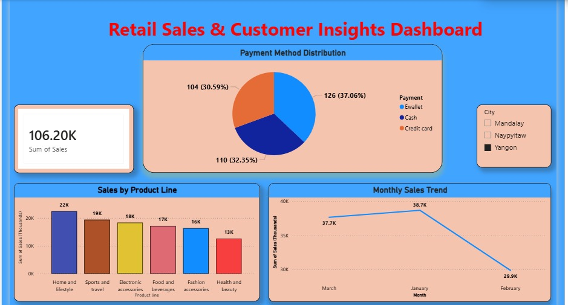

 🛒 Retail Sales & Customer Insights Analysis

 📌 Project Overview

This project analyzes retail sales data to identify sales trends, customer purchasing behavior, and product performance using Power BI.

The objective of this analysis is to transform raw retail transaction data into actionable business insights that can support data-driven decision-making.

 🎯 Objectives

* Analyze sales trends and revenue performance.
* Identify top-performing products and categories.
* Understand customer purchasing patterns.
* Evaluate sales performance across different segments.
* Create interactive dashboards for business reporting.

 🛠️ Tools & Technologies Used

* Power BI
* Microsoft Excel
* CSV Dataset
* Data Cleaning & Transformation
* Data Visualization
* Business Analysis

 📊 Key Analyses Performed

 1. Sales Performance Analysis

* Analyzed total sales and revenue trends.
* Identified periods with high and low sales.

 2. Product Performance Analysis

* Identified best-selling and low-performing products.
* Evaluated product category performance.

 3. Customer Insights Analysis

* Studied customer purchasing behavior.
* Identified valuable customer segments.

 4. Dashboard Creation

* Developed an interactive Power BI dashboard.
* Created KPIs and visual reports for decision-making.

 📈 Key Insights

* Identified products contributing the highest revenue.
* Discovered customer purchasing trends and preferences.
* Highlighted key sales patterns and business opportunities.
* Generated insights to support strategic business decisions.

 💡 Skills Demonstrated

* Data Cleaning
* Data Transformation
* Exploratory Data Analysis (EDA)
* Data Visualization
* Dashboard Development
* Business Insight Generation
* Power BI Reporting

 🚀 Project Outcome

This project demonstrates the ability to:

* Analyze business data and identify trends.
* Build interactive dashboards using Power BI.
* Transform raw data into actionable insights.
* Support business decisions using data analytics.

  📸 Dashboard Snapshot

 👩‍💻 Author

Vaishnavi Basavaraj Pujari

Aspiring Data Analyst passionate about transforming raw data into meaningful insights and business decisions.

📧 Email: vaishnavipujari4444@gmail.com

🔗 LinkedIn: https://www.linkedin.com/in/vaishnavi-pujari-802783256

⭐ Feel free to explore the repository and connect with me on LinkedIn.
